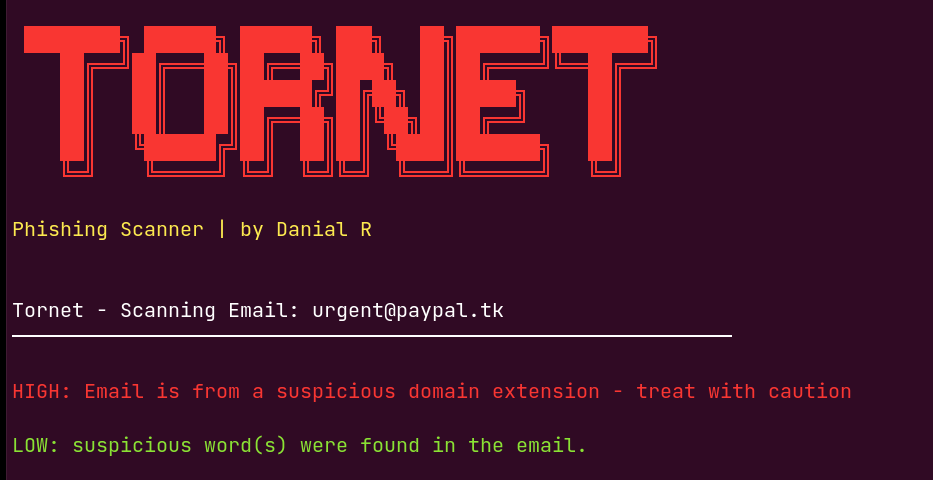

# Tornet

They made a net to phish you in? Tear it with Tornet

## What it does
**Tornet** is comprised of 2 main components: Email scanner and URL scanner.

The **email scanner** checks the entire email for suspicious domains, keywords, and anything that could be a potential phishing email address. It categorizes them into LOW, MEDIUM, and HIGH alert based on the email

The **URL scanner** checks the entire URL for: use of HTTP, use of shorteners, suspicious keywords, IP addresses, and lookalike characters . It categorizes them into LOW, MEDIUM, and HIGH alert based on the words used in the URL

## Installation

1. Clone the repository:
   ```
   git clone https://github.com/Robinhood-r/tornet
   ```

2. Navigate to the project folder:
   cd tornet

3. No dependencies required — Tornet uses Python built-in libraries only

## Usage

To scan a URL:
   ```
   python3 cli.py --url https://suspicious-site.tk
   ```
   
To scan an email:
   ```
   python3 cli.py --email urgent@paypal.tk
   ```

## Example output




## Author
Danial R — Cybersecurity enthusiast and aspiring bug bounty hunter
